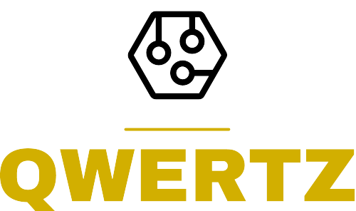

<div align="center">




</div>
# OT - Awareness Schulung

Dieses Repository enthält den Prototypen einer Awareness-Schulungen im Bereich OT-Security. Welcher im
Softwareentwicklungsprojekt der Hochschule Mannheim im Sommersemester 2022 vom Team QWERTZ entwickelt wurde.

## Table of Contents

- [Installation](#Installation)
- [Database](#Database)
- [Starten der Software](#Starten_der_Software)
- [Architektur](#Architektur)
- [Mocha Tests](#Mocha_Tests)
- [Technologien](#Technologien)
- [Limitation List](#Limitation-List)
- [License](#License)


##Installation
- Installiere [Npm](https://nodejs.org/en/download/)
- Clone das Repository ```git clone https://github.com/bastian1901/OT-Awareness-Schulung.git```
###Backend
- Navigiere in den server Ordner ```cd server```
- Installiere Abhängkeiten ```npm install```
- Link der MongoDB unter ```MONGO_URI``` in [.env](https://github.com/bastianfeil/qwertz_backend/tree/master/.env) einfügen
###Frontend
- navigiere in den frontend Ordner ```cd frontend```
- Installiere Abhängkeiten ```npm install```

## Database
Für dieses Repo wird eine MongoDB benötigt.
Diese kann bei einem beliebigen Anbieter oder auch lokal gehostet werden.

- [Demodaten](https://github.com/bastianfeil/qwertz_backend/blob/master/OT-DEMO-Datas.zip)
    - Demo-Daten der Badges als JSON Dateien, zum einpflegen in die MongoDB.
    - Badges mit Fließtext und Lösungen der Badges.
    - Badges mit Fließtext ohne Lösungen und Aufgabenstellungen der Badges.

- [Datenstruktur](https://github.com/bastianfeil/qwertz_backend/tree/master/backend/model)

## Starten der Software
- Navigiere in den server Ordner ```cd server```
- Starte den Server ```npm start server```
  - Dieser läuft nun (standardmäßig) auf [http://localhost:5000](http://localhost:5000)
- Navigiere in den frontend Ordner ```cd frontend```
- Danach kann die Anwendung mit ```npm start``` gestartet werden.
    - Diese läuft nun auf (standardmäßig) [http://localhost:3000](http://localhost:3000)


## Architektur
Zur [Architektur](https://github.com/bastianfeil/OT-Awareness-Schulung/blob/master/src/Ressources/Architektur.pdf)

## Mocha Tests
- Navigiere in den server Ordner ```cd server```
- Die Automatisierten [Mocha](https://mochajs.org/) Tests lassen sich nun mit ```npm test``` starten.


## Technologien
- [React](https://reactjs.org/)
- [ReactDND](https://react-dnd.github.io/react-dnd/)
- [NodeJS](https://nodejs.org)
- [Mantine](https://mantine.dev/)

## Limitation List
Zur [Limitation List](https://github.com/bastianfeil/OT-Awareness-Schulung/blob/master/src/Resources/LimitationList.pdf)


## Architektur
Zur [Architektur](https://github.com/bastianfeil/OT-Awareness-Schulung/blob/master/src/Ressources/Architektur.pdf)

## License

OT-Awareness ist lizenziert unter
der [MIT License](https://github.com/bastianfeil/qwertz/blob/master/LICENSE).
